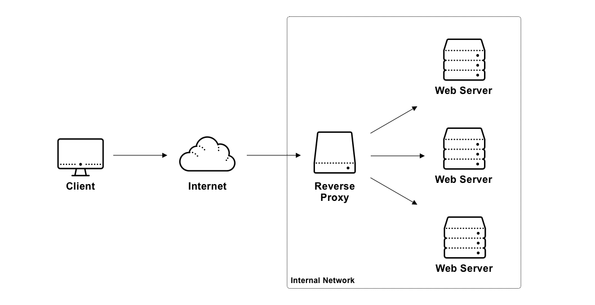

I had to capture metrics from a service I couldn’t directly access. Here’s how the go standard library solved my problem.

At [determined.ai](https://determined.ai) we enable teams of engineers to train deep learning models frictionlessly. With that said, how do models go from trained on our platform to available over the web for inference? One of our clients wanted to know exactly that. Enter the demo I was asked to build. In a single command, pull, deploy, and record response metrics from a model trained on our platform. Once the service comes online, visualize relevant metrics in  [Grafana](https://grafana.com/).

We chose a TensorFlow model for our example. I pulled the checkpoint and wrapped it in a web service via [Tensorflow Serving](https://www.tensorflow.org/tfx/guide/serving)  in an afternoon, which just left visualizing the model metrics. Turns out TensorFlow Serving doesn’t record the response metrics we were hoping to capture. I was running TensorFlow Serving as is, in it’s own process. For all intents and purposes I didn’t have access to the source for the service, so how could I record the metrics we needed?

Since the model is used over the web, clients could access the service via a reverse proxy. The proxy could then record metrics before responding to clients with their inference results. From there, exporting metrics to [Prometheus](https://prometheus.io) and rendering some graphs in [Grafana](https://grafana.com/) would be pretty simple.

## What is a Reverse Proxy?
> ”In [computer networks](https://en.wikipedia.org/wiki/Computer_network) , a reverse proxy is a type of [proxy server](https://en.wikipedia.org/wiki/Proxy_server) that retrieves resources on behalf of a client from one or more servers. These resources are then returned to the client, appearing as if they originated from the proxy server itself. “
>
> From [Wikipedia](https://en.wikipedia.org/wiki/Reverse_proxy)

Essentially, a reverse proxy forwards traffic from a client to a set of servers behind the proxy. There are many applications for reverse proxies. Load balancing, TLS termination, and A/B testing are just a few.  Reverse proxies are also useful for inserting instrumentation around an HTTP service without having to modify the service itself.



If you’d like to learn more about proxying I recommend checking out  [Introduction to modern network load balancing and proxying](https://blog.envoyproxy.io/introduction-to-modern-network-load-balancing-and-proxying-a57f6ff80236)  by Matt Klein. Matt is the creator of [Envoy Proxy](https://www.envoyproxy.io/), a robust proxy server that powers service mesh tools like [Istio](https://istio.io/). His post does a great job of outlining the approaches used by modern load balancers and proxies.

## Simple Go Reverse Proxy
Go is one of my favorite programming languages for many reasons. The designers of the language focused on Simplicity, practicality, and performance. These considerations make Go a joy to use. The language shines with networking tasks. Part of the reason for this is the incredibly comprehensive standard library, which among other common implementations includes a reverse proxy 🤯.

Rolling your own proxy in go is as simple as
```go
proxy := httputil.NewSingleHostReverseProxy(url)
```
Yep, that’s it. Let’s dig in here. The _[httputil.NewSingleHostReverseProxy](https://golang.org/pkg/net/http/httputil/#NewSingleHostReverseProxy)_ method returns a _[ReverseProxy](https://golang.org/pkg/net/http/httputil/#ReverseProxy)_ struct containing the following method.

```go
func (p *ReverseProxy) ServeHTTP(rw http.ResponseWriter, req *http.Request)
```

All we need to do is configure the proxy and wire it up to a standard go HTTP server to have a working reverse proxy as shown below.

```go
package main

import (
	"flag"
	"log"
	"net/http"
	"net/http/httputil"
	"net/url"
	"strconv"
)

func main() {
	port := flag.Int("port", 8080, "port to listen on")
	targetURL := flag.String("target-url", "", "downstream service url to proxy to")
	flag.Parse()

	u, err := url.Parse(*targetURL)
	if err != nil {
		log.Fatalf("Could not parse downstream url: %s", *targetURL)
	}

	proxy := httputil.NewSingleHostReverseProxy(u)

	director := proxy.Director
	proxy.Director = func(req *http.Request) {
		director(req)
		req.Header.Set("X-Forwarded-Host", req.Header.Get("Host"))
		req.Host = req.URL.Host
	}

	http.HandleFunc("/", proxy.ServeHTTP)
	log.Printf("Listening on port %d", *port)
	log.Fatal(http.ListenAndServe(":"+strconv.Itoa(*port), nil))
}
```
That’s it! This server can proxy HTTP requests and web socket connections. You’ll notice that I’ve configured the _proxy.Director_ field. The _ReverseProxy.Director_ is a function that modifies the incoming request before it is forwarded. The signature is as follows:
```go
Director func(*http.Request)
```
A common use case for the director function is modifying request headers. One of the principles of the Go programming language is that types should have sane defaults and be immediately usable. Following this principle, the default director implementation returned by _httputil.NewSingleHostReverseProxy_ takes care of setting the request Scheme, Host, and Path. I didn’t want to duplicate the code, so I wrapped that implementation. __Note__: I had to reset the _req.Host_ field to handle HTTPS endpoints. I’ve also included an example of setting a request header via _[req.Header.Set](https://golang.org/pkg/net/http/#Header.Set)_ which will override the header value with the value passed into the method.

## Capturing Metrics
Let’s extend our simple proxy to read and report metrics about the downstream service responses. To do this we’ll return to the _httputil.ReverseProxy_ struct once more. It exposes a struct field _ReverseProxy.ModifyResponse_ which gives us access to the HTTP response before it goes back to the client.
```go
ModifyResponse func(*net/http.Response) error
```
Go implements HTTP bodies as _io.Reader_’s and, therefore, you may only read them once. If you would like to parse a request or response before forwarding it you will need to copy the body into a byte buffer and reset the body. An obvious drawback is that we buffer the entire response in memory without limit. This could lead to memory issues in production if you received a large response but for our use case this wasn’t an issue. Here’s a quick implementation to parse and reset the response body.
```go
func parseResponse(res *http.Response, unmarshalStruct interface{}) error {
	body, err := ioutil.ReadAll(res.Body)
	if err != nil {
		return err
	}
	res.Body.Close()

	res.Body = ioutil.NopCloser(bytes.NewBuffer(body))
	return json.Unmarshal(body, unmarshalStruct)
}
```
With the request body problem solved, capturing metrics is simple.
```go
proxy := httputil.NewSingleHostReverseProxy(u)
// Configure proxy.Director ...

// ModifyResponse runs before forwarding the downstream response back to the client
proxy.ModifyResponse = func(res *http.Response) error {
	responseContent := map[string]interface{}{}
	err := parseResponse(res, &responseContent)
	if err != nil {
		return err
	}

	return captureMetrics(responseContent)
}
```

And that’s it! The capture metrics function was pretty specific to my use case so I’ll leave it up to you to implement. I ended up using the [Prometheus client](https://github.com/prometheus/client_golang) library to predicted labels.

The full code for the metrics capturing proxy is as follows
```go
package main

import (
	"bytes"
	"encoding/json"
	"flag"
	"io/ioutil"
	"log"
	"net/http"
	"net/http/httputil"
	"net/url"
	"strconv"
)

func parseResponse(res *http.Response, unmarshalStruct interface{}) error {
	body, err := ioutil.ReadAll(res.Body)
	if err != nil {
		return err
	}
	res.Body.Close()

	res.Body = ioutil.NopCloser(bytes.NewBuffer(body))
	return json.Unmarshal(body, unmarshalStruct)
}

func captureMetrics(m map[string]interface{}) error {
	// Add your metrics capture code here
	log.Printf("captureMetrics = %+v\n", m)
	return nil
}

func main() {
	port := flag.Int("port", 8080, "port to listen on")
	targetURL := flag.String("target-url", "", "downstream service url to proxy to")
	flag.Parse()

	u, err := url.Parse(*targetURL)
	if err != nil {
		log.Fatalf("Could not parse downstream url: %s", *targetURL)
	}

	proxy := httputil.NewSingleHostReverseProxy(u)

	director := proxy.Director
	proxy.Director = func(req *http.Request) {
		director(req)
		req.Header.Set("X-Forwarded-Host", req.Header.Get("Host"))
		req.Host = req.URL.Host
	}

	proxy.ModifyResponse = func(res *http.Response) error {
		responseContent := map[string]interface{}{}
		err := parseResponse(res, &responseContent)
		if err != nil {
			return err
		}

		return captureMetrics(responseContent)
	}

	http.HandleFunc("/", proxy.ServeHTTP)
	log.Printf("Listening on port %d", *port)
	log.Fatal(http.ListenAndServe(":"+strconv.Itoa(*port), nil))
}
```
Go's standard library did all the heavy lifting necessary to get the demo up and running. From here you could extend the proxy to any number of use cases. Hopefully, you're as excited as I am about the practically of the go standard library. If you found this at all useful leave a comment below.
