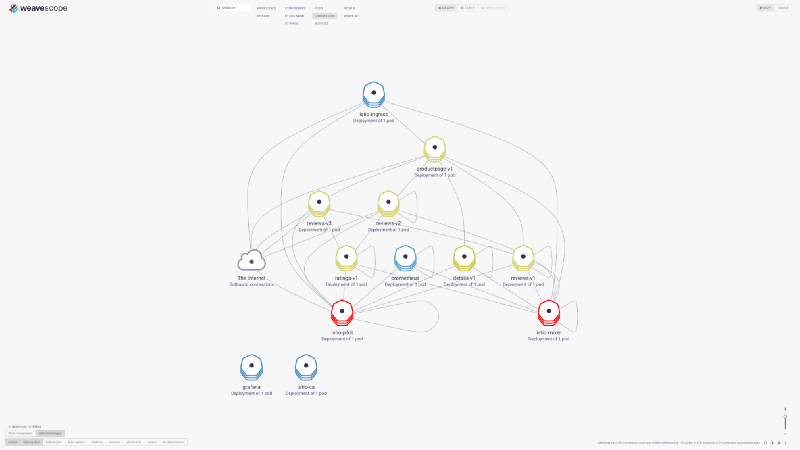
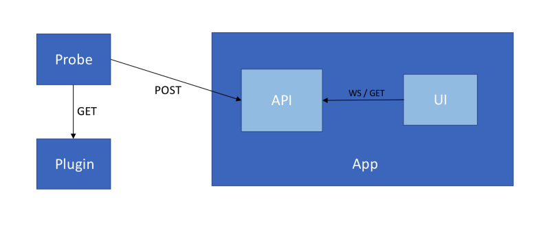
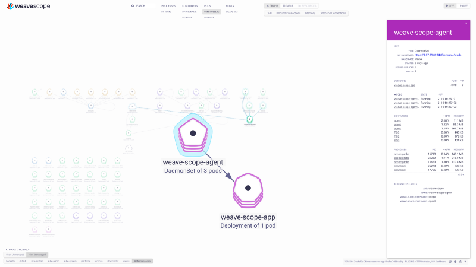

Let’s extend Weave Scope by adding links to a Kubernetes resource dashboard.

Understanding application topology is difficult, if not impossible via Kubernetes dashboard table views.

Here at IBM Cloud Private, we want to deliver a productive user experience. Users should be able to visually understand, monitor, and manage their workloads. Therefore, we leveraged [Weave Scope](https://www.weave.works/oss/scope/) and extended it’s feature set to include links back into the IBM Cloud Private management dashboard.

## What is Weave Scope?
From the Weave Scope [documentation](https://www.weave.works/docs/scope/latest/introducing/):

> Weave Scope is a visualization, and monitoring tool for Docker and Kubernetes. It provides a top down view into your app as well as your entire infrastructure, and allows you to diagnose any problems with your distributed containerized app, in real time, as it being deployed to a cloud provider.

Essentially, Weave Scope is an interactive service graph. It provides a runtime view into your cluster. There are no static diagrams of how your cloud components interact, just visual representations of connections based on network traffic. We also get basic controls like scaling up a deployment from Weave Scope which means users can make changes to their applications without switching contexts between monitoring and management dashboards. The ui is extendable via plugins. Plugins can provide additional data and, after our change to Weave Scope, links to relevant interfaces. Here is an example app in Weave Scope.



<span class="caption">
	Weave Scope Sample Application Topology
</span>

The product provides enough features for an article onto it’s own. I encourage you to [install Weave Scope](https://www.weave.works/docs/scope/latest/installing/) in your cluster and see for yourself. You‘ll be needing an install to follow along in the next steps.

## Weave Scope Architecture
Understanding the architecture is critical to generating more data via a plugin. There are three core components, plugins, and a data structure we need to unpack.



<span class="caption">
	Weave Scope Topology
</span>

The probe collects information from the cluster. This includes containers, deployments, endpoints, hosts, plugins, etc. It compiles this information into a report and posts it to the app.

The report is the data structure that contains all the information about resources in the cluster. Let’s look at an example report.

```json
{
  "Plugins": [
    {
      "id": "sample-plugin",
      "label": "Sample Weave Plugin",
      "description": "Adds links to deployments",
      "interfaces": [
        "reporter"
      ],
      "api_version": 1
    }
  ],
  "Container": {},
  "ContainerImage": {},
  "DaemonSet": {},
  "Deployment": {
    "nodes": {
      "12345;<deployment>": {
        "latest": {
          "sample-link--meta": {
            "value": "/console/workloads/deployments/default/test-deployment",
            "timestamp": "0001-01-01T00:00:00Z"
          }
        }
      },
      "67890;<deployment>": {
        "latest": {
          "sample-link--meta": {
            "value": "/console/workloads/deployments/default/test-kubernetes-object",
            "timestamp": "0001-01-01T00:00:00Z"
          }
        }
      }
    },
    "metadata_templates": {
      "sample-link--meta": {
        "id": "sample-link--meta",
        "label": "sample Dashboard",
        "dataType": "link",
        "priority": 1.1,
        "from": "latest"
      }
    }
  },
  "Endpoint": {},
  "Host": {},
  "Pods": {},
  "Process": {},
  "ReplicaSet": {},
  "Service": {}
}
```
The report is organized by topology. All available topologies are listed here to show what’s possible but plugins can leave out any topologies. This report only contains link data for deployments so we could leave out the rest.

Inside of each topology we have nodes, and templates. Nodes refer to the specific Kubernetes resource the data is referring to. The keys are of the form *&lt;Kubernetes UID&gt;;&lt;topology&gt;*. You will have to query Kubernetes to retrieve this UID value.

There are 3 kinds of templates: metadata, metric, and table templates. Each is rendered differently in the Weave Scope ui so it’s important to choose the right one for your plugin. Metrics are displayed as a graph. These tables are useful for stats over time. Metadata templates render as key value pairs and table templates can show multiple columns of data. Each template specifies a datatype. Here at IBM Cloud Private we implemented the link data type for Weave Scope plugins allowing users to add links to the ui. Using this feature we provide links into our dashboard so users can easily get more informations.

Lastly, the plugin must provide some metadata about itself. This is shown in the “Plugins” field.


<span class="caption">
	Table Types
</span>

The app component aggregates reports from the probes and sends the information to the ui for display. The final report is a merge of the probe and plugin reports. Therefore the report is how we add relevant data to the ui.

# Writing the Plugin
Now that we understand what we’re doing, let’s create the link plugin. We’ll be writing this plugin in Go.

There are two steps — Registering the plugin and responding to poll events.

Plugins communicate with the probes via a unix socket in */var/run/scope/plugins*. The probe looks for sockets in this directory of the form *plugin-id/plugin-id.sock*. Note that the plugin id you send along with the report must match the plugin id of the socket. This file registers the plugin to the probe.

Once the probe finds this file, it will periodically make requests to *GET /report* on the socket. Your plugin has 500ms to respond to this poll event. This is a tight deadline if you have to reach out to external data sources or do any data transforms. Depending on your use case, it might be wise to decouple generating the report from the request handler. In our example plugin, we are going to poll at our own interval and respond to the probe request with whatever data we have at the time.

Here is the example code for setting up the weave plugin.

```go
package main

import (
	"fmt"
	"log"
	"net"
	"net/http"
	"os"
	"os/signal"
	"path/filepath"
	"sync"
	"syscall"
	"time"
)

func main() {
	var plugin = &Plugin{
		ID:          "sample-plugin",
		Label:       "Sample Weave Plugin",
		Description: "Adds links to deployments",
		Interfaces:  []string{"reporter"},
		APIVersion:  1,

		sync: sync.Mutex{},
	}

	socketPath := fmt.Sprintf("/var/run/scope/plugins/%s/%s.sock", plugin.ID, plugin.ID)

	// Handle the exit signal
	setupSignals(socketPath)

	listener, err := setupSocket(socketPath)
	if err != nil {
		log.Fatal(err)
	}

	defer func() {
		listener.Close()
		os.RemoveAll(filepath.Dir(socketPath))
	}()

	ticker := time.NewTicker(5 * time.Second)
	go plugin.poll(ticker)

	http.HandleFunc("/report", plugin.HandleReport)
	if err := http.Serve(listener, nil); err != nil {
		log.Printf("error: %v", err)
	}
}

func setupSocket(socketPath string) (net.Listener, error) {
	os.RemoveAll(filepath.Dir(socketPath))
	if err := os.MkdirAll(filepath.Dir(socketPath), 0700); err != nil {
		return nil, fmt.Errorf("failed to create directory %q: %v", filepath.Dir(socketPath), err)
	}

	listener, err := net.Listen("unix", socketPath)
	if err != nil {
		return nil, fmt.Errorf("failed to listen on %q: %v", socketPath, err)
	}

	log.Printf("Listening on: unix://%s", socketPath)

	return listener, nil
}

func setupSignals(socketPath string) {
	interrupt := make(chan os.Signal, 1)
	signal.Notify(interrupt, os.Interrupt, syscall.SIGTERM)

	go func() {
		<-interrupt
		os.RemoveAll(filepath.Dir(socketPath))
		os.Exit(0)
	}()
}
```

<span class="caption">
	Sample Weave Scope Setup
</span>
This is essentially all the boilerplate needed to have a working plugin. The plugin has registered itself and is now listening for Get /report from the probe. Let’s look at how we might implement the plugin data type.

```go
type Plugin struct {
	ID          string   `json:"id"`
	Label       string   `json:"label"`
	Description string   `json:"description,omitempty"`
	Interfaces  []string `json:"interfaces"`
	APIVersion  int      `json:"api_version,omitempty"`

	Report WeaveReport

	// This is a concurrently accessed data structure
	// acquire the lock before mutating
	sync sync.Mutex
}

// Execute a list of Kubernetes queries and add link data
// to the report
func (p *Plugin) GenerateReport(queries []K8sQuery) {
	client := GetK8sClient()

	done := make(chan bool)

	// Execute queries concurrently
	for _, k8sQuery := range queries {
		// Calls syncAdd with each kubernetes resource object
		go queryWorker(client, k8sQuery, p.syncAdd, done)
	}

	// Wait for all the queries to exit
	for range queries {
		<-done
	}
}

func (p *Plugin) poll(ticker *time.Ticker) {
	// Get the report before waiting
	p.WeaveReportInit()
	p.GenerateReport([]K8sQuery{MapDeployments})

	for range ticker.C {
		p.GenerateReport([]K8sQuery{MapDeployments})
		Debug(func() { p.LogReport("pollK8s") })
	}
}

func (p *Plugin) HandleReport(w http.ResponseWriter, r *http.Request) {
	p.sync.Lock()
	raw, err := json.Marshal(&p.Report)
	p.sync.Unlock()

	if err != nil {
		http.Error(w, err.Error(), http.StatusInternalServerError)
		log.Fatalf("JSON Marshall Error %v", err)
		return
	}

	w.WriteHeader(http.StatusOK)
	w.Write(raw)
}

// Acquire the mutex and mutate the report
func (p *Plugin) syncAdd(obj K8sObject) {
	// Get the relevant topology from the report
	top := SelectTopology(&p.Report, obj)

	weaveID, _ := GetWeaveID(obj)

	metaID, metaTemplate := GetMetaTemplate()

	// Get the link data from the kubernetes object
	metaLatestID, metaLatest := GetMetaLatest(obj)

	p.sync.Lock()
	defer p.sync.Unlock()
	top.AddMetadataTemplate(metaID, metaTemplate)
	top.AddLatest(weaveID, metaLatestID, metaLatest)
}
```

<span class="caption">
	Plugin Data Type
</span>

Our three main methods are *GenerateReport*, *Poll*, and *HandleReport.*

*GenerateReport* does the work of aggregating our data.
*Poll* calls *GenerateReport* at regular intervals to get fresh data
*HandleReport* responds to the probe request
Additionally, *syncAdd* is a helper method that adds the link data to the report in a goroutine safe way by acquiring a mutex.

What’s really happening here? We are using the [Kubernetes go client library](https://github.com/kubernetes/client-go) to get Kubernetes resource objects generating links for our plugin to display. Table templates have a “from” field which tells them which subfield of the node portion fo the report to pull data from. We’re using latest. The following gist is the last piece of the puzzle as to how all of this comes together.

```go
import (
	"fmt"

	meta_v1 "k8s.io/apimachinery/pkg/apis/meta/v1"
	"k8s.io/client-go/kubernetes"
	"k8s.io/client-go/rest"
)

type K8sObject interface {
	GetAnnotations() map[string]string
	GetLabels() map[string]string
	GetName() string
	GetNamespace() string
	GetUID() types.UID
}

type K8sQuery func(*kubernetes.Clientset, func(K8sObject))

func GetK8sClient() *kubernetes.Clientset {
	config, err := rest.InClusterConfig()
	if err != nil {
		panic(err.Error())
	}

	client, err := kubernetes.NewForConfig(config)
	if err != nil {
		panic(err.Error())
	}

	return client
}

func MapDeployments(client *kubernetes.Clientset, do func(K8sObject)) {
	deployments, _ := client.Apps().Deployments("").List(meta_v1.ListOptions{})

	for _, k8sobject := range deployments.Items {
		do(&k8sobject)
	}
}

func GetMetaLatest(obj K8sObject) (id string, latest LatestSample) {
  	url, _ := GetDashboardUrl(obj)

	// Meta data table ID
	id = fmt.Sprintf("%s-meta", PREFIX)
	latest = LatestSample{Value: url}

	return
}
```

<span class="caption">
	Query K8s Example
</span>

Here I am showing how to query all the deployments in the cluster. You can easily see how to extend this to all the Kubernetes resource types. I’ll leave the implementation of *GetDashboardUrl* up to you for your use case. Our plugin builds a link by formatting */workloads/deployments/<namespace>/<name>* where namespace and name come from the deployment itself. For a concrete example check out the [sample plugin repository](https://github.com/RcrsvSquid/weavescope-icp-dashboard-plugin).

We’re essentially done building our plugin. There is just one piece left. The deployment. You need to mount the following volume in order for the probe to find the unix socket

```yaml
volumes:
      - name: scope-plugins
        hostPath:
          path: /var/run/scope/plugins
```

Check out the full example in the [sample plugin repository](https://github.com/RcrsvSquid/weavescope-icp-dashboard-plugin).

Here’s what my plugin ended up posting to weave:



<span class="caption">
	Weave Scope With Links
</span>

And we’re done! I hope you enjoyed a first glimpse into building a Weave Scope plugin. Feel free to leave comments and feedback below. If you enjoyed this article, we may visit a more complex example in the future like adding metrics to the view.
